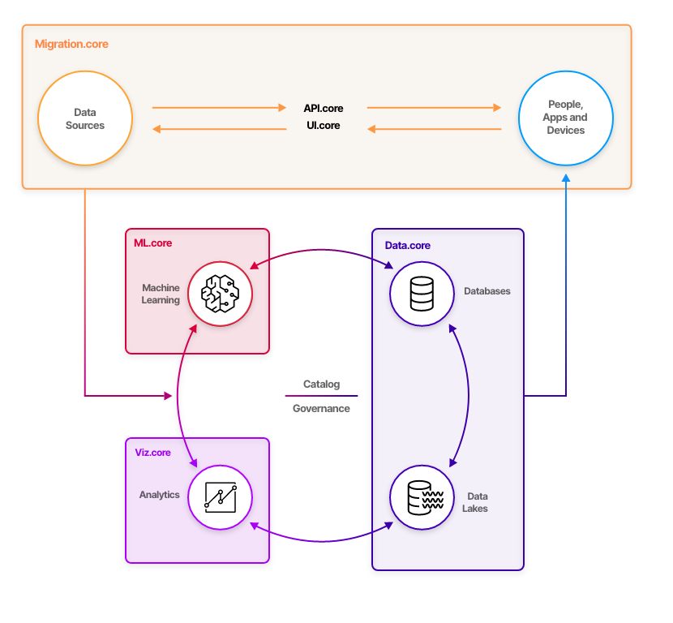
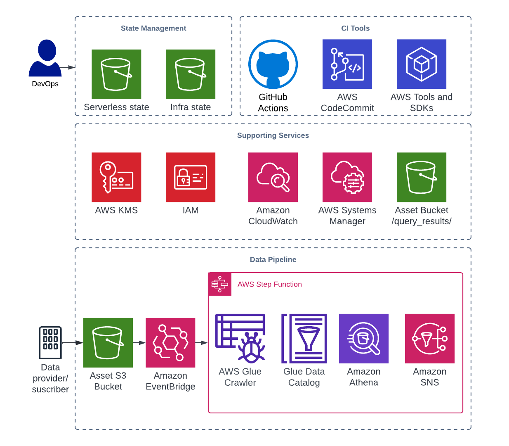

# Firemind Data Toolkit Framework

[Report issue](https://github.com/hellofiremind/data-toolkit/issues/new?assignees=&labels=&template=bug_report.md&title=)
. [Submit a feature](https://github.com/hellofiremind/data-toolkit/issues/new?assignees=&labels=&template=feature_request.md&title=)

<details>
  <summary>Table of Contents</summary>
  <ol>
    <li><a href="#user-content-about-the-project">About The Project</a></li>
    <li><a href="#user-content-initial-setup">Initial Setup</a></li>
    <ol>
      <li><a href="#user-content-prerequisites">Pre-requisites</a></li>
      <li><a href="#user-content-deploy-iam-role-and-oidc-identity-provider">Deploy IAM Role and OIDC Identity Provider</a></li>
      <li><a href="#user-content-github-workflows">GitHub workflows</a></li>
      <li><a href="#user-content-infrastructure-setup">Infrastructure Setup</a></li>
   </ol>
    <li><a href="#user-content-sample-workflow-execution-details">Sample Workflow Execution Details</a></li>
    <li><a href="#user-content-tldr">TL;DR Quick Setup</a></li>
  </ol>
</details>
<br />

**TL;DR**: This framework allows you to get started with a <b> Data Pipeline</b> on AWS using native services and ETL
Tools. The example in this framework AWS Glue and Amazon Athena for schema generation and data query.

#### Data Toolkit is part of [Firemind's suite of Ignite](https://firemind.com/offerings/ignite/) tools

[](https://www.firemind.io/offerings/ignite/data-core/)

<!-- ABOUT THE PROJECT -->

### Key AWS Services

- AWS Step Functions
- AWS Glue
- Amazon Athena
- Amazon EventBridge
- AWS Identity Access Management (IAM) Roles
- Amazon Simple Storage Service (Amazon S3) Buckets
- AWS Systems Manager Parameter Store (SSM) Parameters
- Amazon Simple Notification Service (Amazon SNS)


## Infrastructure Diagram

[](https://www.firemind.io/offerings/ignite/data-core/)

## Initial Setup
<!-- INITIAL SETUP -->

<!-- PREREQUISITES -->

### Prerequisites

Ensure your CLI has correct credentials to access the AWS account you want this framework deployed to.

To use this framework, create an empty remote repo in your organisation in GitHub, clone a copy of this repo and push to
your remote.

Navigate to `github-oidc-federation-template-infra.yml` file and add a default value for:

- `GitHubOrg`: This should be the name of the organisation where your repo exists.
- `FullRepoName`: The name of the repo which has a copy of this infrastructure.

Add the following to your remote repository secrets:

- `AWS_REGION`: <e.g. eu-west-1>.
- `S3_TERRAFORM_STATE_REGION`: <e.g. eu-west-1>.
- `S3_TERRAFORM_STATE_BUCKET`: ml-core-<account_id>-state-bucket.
- `ACTION_IAM_ROLE`: arn:aws:iam::<account_id>:role/GithubActionsDeployInfra.

Further details can be
found <a href="https://github.com/Azure/actions-workflow-samples/blob/master/assets/create-secrets-for-GitHub-workflows.md" target="_blank"></a>
<!-- DEPLOY IAM ROLE AND OIDC IDENTITY PROVIDER -->
### Deploy IAM Role and OIDC Identity Provider

The first step is to deploy a GitHub Actions Role and GitHub OIDC identity provider in the account that allows you to
run GitHub actions for the infrastructure.

**Note:** This only needs to be run once per AWS account. Details on this can be found
here: https://github.com/marketplace/actions/configure-aws-credentials-action-for-github-actions

- <b>Important Note:</b> If an identity provider already exists for your project. <i>Always check that the identity
  provider exists for your project, which can be found within the AWS IAM console.</i>

Run the following command in the terminal. Can change the stack name and region:

```
aws cloudformation deploy --template-file github-oidc-federation-template-infra.yml --stack-name app-authorisation-infra-github-authentication --region {{ eu-west-1 }} --capabilities CAPABILITY_IAM --capabilities CAPABILITY_NAMED_IAM
```

<!-- GITHUB WORKFLOWS -->

### Github Workflows

GitHub actions is used to deploy the infrastructure. The config for this can be found in the `.gitHub/workflows`

We send through a variety of different environment variables

- `BUILD_STAGE` - We get this from the branch names.
- `S3_TERRAFORM_STATE_BUCKET` - Get this from GitHub secrets.
- `S3_TERRAFORM_STATE_REGION` - Get this from GitHub secrets.
- `AWS_REGION` - Get this from GitHub secrets.
- `SERVICE` - Has default but can be set by user in the `.github/workflows` files.

<!-- INFRASTRUCTURE SETUP -->

### Infrastructure Setup

For quick setup follow these instructions:

- Create an empty repo within your GitHub account.
- Checkout this repository on development branch to you local drive and push to your remote repo.
- Assuming the GitHub actions have been set up correctly, the deployment will begin.

If you are having any issues please report a bug via the repo.

<!-- SAMPLE WORKFLOW EXECUTION DETAILS -->

## Sample Workflow Execution Details

<ol>
  <li>Once the infrastructure has been deployed, navigate to S3 and find the bucket created by the framework <code>data-core-[stage]-[account_id]-asset-bucket</code>.</li>
  <li>Navigate to <code>input_data/</code> folder and upload the sample data found in <code>sample-data/AC2021_AnnualisedEntryExit.csv</code>.</li>
  <li>This triggers an <code>Amazon EventBridge</code> Rule that targets the Data Pipeline <code>Step Function</code> on Object Creation to S3.</li>
  <li>Navigate to the AWS Step Function service and notice the workflow running.
    <ul><li>The first state starts a <code>Glue Crawler</code> that generates a data schema based on the uploaded data.</li></ul>
    <ul><li>This schema is stored in a <code>Glue Data Catalog</code>.</li></ul>
    <ul><li>Once the Glue Crawler has finished running, a map of SQL queries are executed in parallel through <code>Amazon Athena</code>.</li></ul>
    <ul><li>The results of the queries are saved back to S3 under the <code>query_results/</code> suffix.</li></ul>
    <ul><li>Finally, an <code>SNS</code> message is sent to the configured SNS Topic. **Note**: There are no subscribers to this topic but this can be configured.</li></ul>
  </li>
</ol>

<!-- TLDR -->

## TL;DR

Configure your AWS credentials in the CLI with permissions to deploy to your account.

Deploy

```
bash deployment-scripts/quick-deploy.sh
```

Destroy

```
bash deployment-scripts/quick-destroy.sh
```
